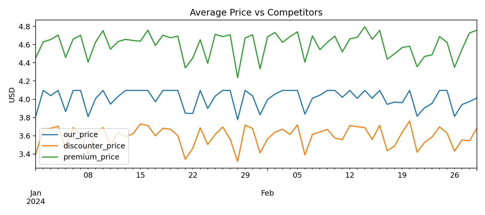
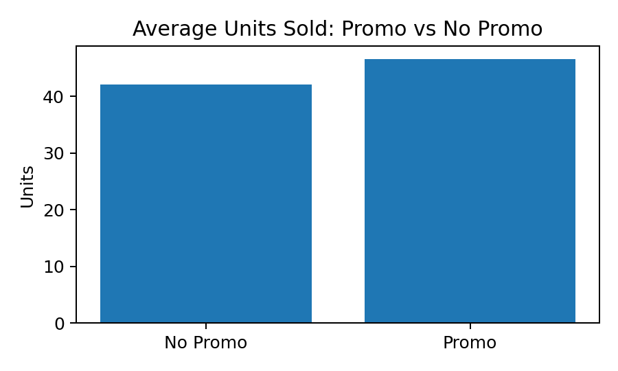
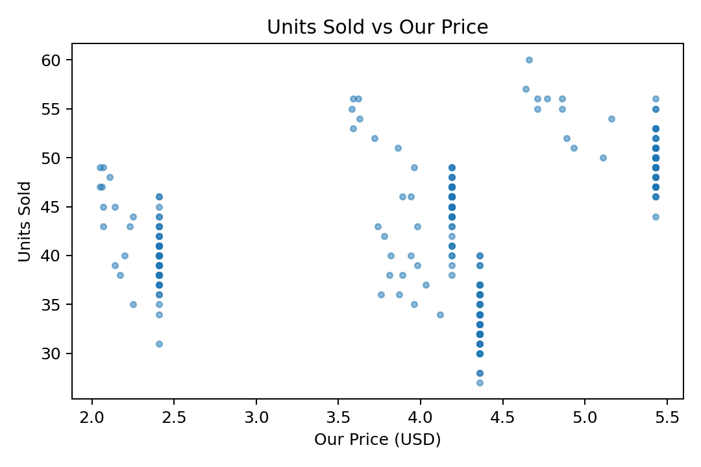

<h1 align="center">🥤 Dynamic Pricing Case Study: Plant-Based Beverages</h1>

<p align="center">
  <i>Exploring how pricing, promotions, and competitors shape demand in the plant-based beverage market</i>
</p>

---

## 🌟 Overview  

This mini case study combines **data analytics** with **business insights** to explore pricing strategy across four categories:  
- Oat Milk  
- Almond Milk  
- Kombucha  
- Protein Shakes  

**Key themes:**  
- How do our prices compare to competitors (premium vs. discounter)?  
- What impact do promotions have on sales & revenue?  
- How sensitive is demand to price changes (elasticity)?  
- What-if: Does cutting prices *always* raise revenue?  

---

## 📊 Week 1 Results  

### 🏷️ Pricing Landscape
<p align="center">
  
</p>  

> **Story:** Our pricing consistently sits between discounter (lower) and premium (higher) competitors. Promotions and weekend effects cause visible dips.  

---

### 🎉 Promotion Impact
<p align="center">
  
</p>  

> **Story:** Promotions boost unit sales by **~XX%**. However, revenue gains are not always guaranteed — the depth of discount matters.  

---

### 📉 Price Sensitivity
<p align="center">
  
</p>  

> **Story:** As price rises, units sold decline — classic elasticity. Kombucha shows the steepest sensitivity, suggesting aggressive price cuts could backfire.  

---

## 🧾 Business Insights (Week 1)

- **Positioning:** We are cheaper than premium on 100% of days, but only undercut the discounter 0%.  
- **Promotions:** On average, promo days increase units sold by 10%. The trade-off in revenue needs careful balancing.  
- **Elasticity:** Kombucha demand is highly price sensitive (elasticity -1.16_), while almond milk is steadier (elasticity -1.24_).  
- **What-if Simulation:** A 5% price cut is projected to **(increase)** revenue almond milk (+0.9%) and kombucha (+0.5%), but hurts protein shakes (-0.9%) and oat milk (-0.9%)%.  

---

## 📂 Deliverables  

- **Notebook** → [01_case_study_week1.ipynb](notebooks/01_case_study_week1.ipynb)  
- **Figures** → [`reports/figures/`](reports/figures/)  
- **Tables** → [`reports/tables/`](reports/tables/)  

---

## ⚙️ How to Reproduce  

```bash
# 1. Clone repo & cd into folder
git clone https://github.com/<your-username>/dynamic-pricing-beverages.git
cd dynamic-pricing-beverages

# 2. Create & activate virtual environment
python3 -m venv .venv
source .venv/bin/activate  # Mac/Linux
# .venv\Scripts\Activate   # Windows

# 3. Install dependencies
pip install -r requirements.txt

# 4. Generate dataset
python src/make_data.py

# 5. Explore case study
jupyter notebook notebooks/01_case_study_week1.ipynb
